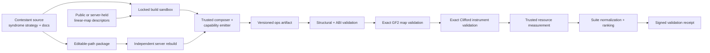

# QMoney Quantum Circuit Contest Design

**Status:** Draft for implementation  
**Document version:** `0.1`  
**Pilot track:** `qmoney-subspace-verifier-8-v1`  
**Repository context:** QMoney research workspace  
**Primary purpose:** Define an implementation-ready, checker-scored quantum circuit optimization contest inspired by the ECDLP 5-bit contest control plane.

## 1. Executive decision

QMoney should launch its first circuit contest around **hidden-subspace verifier syndrome synthesis**, not around the current BB84 mint/measure loop.

The pilot asks contestants to compile the two complementary membership tests for a rank-4 subspace of `F_2^8` into the cheapest exact `CNOT` networks. The trusted harness owns the note register, Hadamard layers, measurements, acceptance rule, fixtures, artifact validation, and scoring. Contestants only receive opaque wire handles and a binary linear-map descriptor.

The winning circuit minimizes a suite-normalized balance of:

- peak logical qubits;
- emitted two-qubit gate count;
- emitted two-qubit dependency depth.

The pilot is a **circuit-synthesis benchmark**, not a claim that QMoney already has secure public-key quantum money. The current Python hidden-subspace prototype publishes enough structure to reconstruct an accepting state.

Two later tracks are reserved but are not part of the pilot:

1. `qmoney-wiesner-counterfeit-1to2-v1`: maximize exact joint counterfeit acceptance under circuit-resource envelopes.
2. `qmoney-coherent-bb84-verifier-v1`: minimize a reversible Hamming-weight threshold oracle derived from the private-key verifier semantics.

---

## 2. Goals and non-goals

## 2.1 Goals

The contest should:

1. freeze a precise quantum semantic contract before accepting optimizations;
2. provide a narrow, capability-based editable surface;
3. separate untrusted circuit construction from trusted evaluation;
4. validate exact quantum semantics, not only sampled basis-state behavior;
5. measure resources from the emitted primitive operation stream;
6. reward meaningful count/depth/ancilla tradeoffs;
7. support reproducible public fixtures and server-held ranked fixtures;
8. preserve experiment notes and architecture diagrams with every submission;
9. distinguish compiler progress from cryptographic-security progress;
10. provide a path from tiny all-to-all circuits to topology-aware compilation.

## 2.2 Non-goals

The pilot does not:

- establish hidden-subspace public-key unforgeability;
- optimize the current 512-qubit BB84 product-state note;
- model fault-tolerant physical-qubit overhead;
- score QMoney quorum availability, settlement, or remint atomicity;
- accept approximate circuits or noisy correctness in version 1;
- allow lookup-table acceptance functions or state-vector inspection;
- treat a low circuit score as evidence of stronger anti-counterfeiting security;
- permit submissions to change the note family, verifier projector, or score model.

---

## 3. Why this is the first track

The current private-key QMoney note consists of independent BB84 qubits. Ideal minting and verification use only conditional single-qubit `X`/`H` operations and measurement. There is no CNOT network and no Toffoli bottleneck. Applying the ECDLP score `Q * sqrt(T * D_T)` would produce a degenerate result.

The hidden-subspace research track contains a better circuit kernel:

- test membership in subspace `A` in the computational basis;
- test membership in `A^perp` after a transversal Hadamard;
- preserve the authentic note on the accepting path;
- compile parity checks with linear reversible circuits.

This creates genuine choices involving:

- generator and parity-check basis selection;
- shared parity intermediates;
- clean scratch allocation;
- CNOT scheduling;
- count versus depth;
- later, routing under a coupling graph.

The pilot therefore reuses the **control-plane discipline** of ECDLP 5-bit while scoring the primitive that matters here: CNOT rather than Toffoli.

---

## 4. Mathematical problem statement

Let:

```text
A <= F_2^n
n = 8
k = dim(A) = 4
G in F_2^(k x n)
H_A in F_2^((n-k) x n)
```

where:

```text
A = rowspan(G)
A^perp = rowspan(H_A)
G H_A^T = 0
rank(G) = k
rank(H_A) = n-k
```

For a computational-basis vector `x`:

```text
x in A       iff H_A x^T = 0
x in A^perp  iff G x^T = 0
```

The ideal hidden-subspace note is:

```text
|A> = 2^(-k/2) sum_(a in A) |a>
```

The trusted verifier performs two complementary syndrome tests.

### Standard-basis test

```text
|x>|0^(n-k)> -> |x>|H_A x^T>
measure syndrome
require all-zero outcome
```

### Complementary-basis test

```text
apply H^tensor-n to note
|x>|0^k> -> |x>|G x^T>
measure syndrome
require all-zero outcome
apply H^tensor-n to restore note basis
```

The final acceptance predicate is:

```text
accept = standard_syndrome_is_zero AND complement_syndrome_is_zero
```

The trusted composer executes both tests with a fixed schedule. It does not use data-dependent early exit, so every candidate has deterministic resource accounting.

For the authentic state `|A>`:

- both syndrome records are zero with probability `1`;
- the final note state is exactly `|A>` in the ideal model;
- all candidate scratch is clean.

---

## 5. Semantic equivalence

The semantic object is the **subspace projector**, not one arbitrary generator order or syndrome-bit labeling.

Contestants may replace canonical matrices with row-equivalent full-rank matrices:

```text
G' = M_X G
H_A' = M_Z H_A
```

where `M_X` and `M_Z` are invertible over `F_2`.

This is valid because an invertible relabeling preserves the all-zero syndrome predicate and the measured stabilizer group.

The evaluator therefore requires:

1. the emitted standard map to preserve the note register and have syndrome row space `rowspan(H_A)`;
2. the emitted complementary map to preserve the note register and have syndrome row space `rowspan(G)`;
3. any syndrome-record relabeling to be invertible;
4. candidate scratch to return to zero;
5. the complete trusted-composed Clifford measurement instrument to implement the same accept projector and accepted-note behavior.

Byte equality with the reference circuit is neither required nor desired.

---

## 6. Pilot circuit ABI

The ranked pilot fixes:

```text
track id: qmoney-subspace-verifier-8-v1
note width: 8
subspace rank: 4
syndrome width: 4
candidate gate set: CX only
connectivity: all-to-all
clean scratch: optional, dynamically allocated
measurement/reset/H: trusted composer only
```

The standard and complementary tests execute sequentially and reuse the same four syndrome wires after trusted measurement/reset.

### Registers

| Register | Width | Owner | Initial state | Required final state |
| --- | ---: | --- | --- | --- |
| `note` | 8 | trusted | arbitrary quantum input | preserved according to verifier instrument |
| `syndrome` | 4 | trusted | `|0000>` per test | measured/reset by trusted composer |
| `scratch` | variable | contestant | clean `|0>` | clean `|0>` before release |
| measurement record | 8 classical bits | trusted | empty | standard + complementary syndromes |
| accept bit | 1 classical bit | trusted | `0` | both records all zero |

### Candidate API

Conceptual interface:

```text
emit_standard_syndrome(
    emitter,
    note: [NoteWire; 8],
    syndrome: [SyndromeWire; 4],
    descriptor: LinearMapDescriptor,
)

emit_complement_syndrome(
    emitter,
    note: [NoteWire; 8],
    syndrome: [SyndromeWire; 4],
    descriptor: LinearMapDescriptor,
)
```

The capability API exposes:

```text
emitter.cx(control, target)
emitter.allocate_clean(count)
emitter.release_clean(wires)
descriptor.rows()
descriptor.input_width()
descriptor.output_rank()
```

It does not expose:

- raw operation-stream mutation;
- trusted fixture IDs or seed material;
- state vectors or amplitudes;
- public-key support enumeration;
- measurement or postselection controls;
- filesystem, process, environment, network, clock, or randomness access;
- mutable global state;
- unsafe code;
- arbitrary unitary macros.

The candidate may perform unrestricted deterministic classical computation at build time to synthesize a CNOT network from the descriptor. Search-based synthesis is allowed.

---

## 7. Allowed computational model

## 7.1 Allowed

- CNOT circuits implementing binary linear transformations;
- deterministic Gaussian-elimination variants;
- row/column ordering searches;
- shared parity intermediates;
- clean-ancilla tradeoffs;
- matrix-content-dependent synthesis strategies;
- exact instance-specific optimization for public fixed-instance tracks;
- generic compilation over server-held matrices for the ranked track.

## 7.2 Forbidden

- truth-table acceptance lookup over `2^n` basis states;
- state-vector simulation inside contestant code;
- changing trusted `H`, measurement, reset, or acceptance operations;
- free `SWAP`, parity, fanout, linear-oracle, or multi-controlled macros;
- output-wire permutation unless explicitly represented and restored;
- dropping or measuring note wires;
- postselection;
- dirty released scratch;
- hidden branching on test IDs, server metadata, or execution environment;
- importing the trusted evaluator or reference synthesizer;
- external data and dynamically downloaded code.

Because the candidate gate API is CNOT-only, the emitted candidate circuit is linear by construction. This is stronger than trying to identify forbidden lookup behavior only with source regexes.

---

## 8. Baseline implementation

The reference baseline directly computes each output parity:

```text
for each syndrome row r:
    for each input column c where matrix[r,c] = 1:
        CX(note[c], syndrome[r])
```

It uses:

- no contestant scratch;
- canonical `G` and `H_A` rows;
- greedy dependency-layer scheduling;
- the same implementation for the standard and complementary tests.

The baseline is intentionally clear rather than optimal. It creates optimization room for:

- lower-weight row-equivalent bases;
- shared partial parity computation;
- scratch-assisted fanout scheduling;
- better cross-row gate ordering;
- exact synthesis methods for small matrices.

### Public smoke fixture

```text
n = 3
k = 2
G = [101, 011]
A = {000, 101, 011, 110}
```

A baseline mint circuit for the companion state-preparation check is:

```text
H(0)
H(1)
CX(0,2)
CX(1,2)
```

The public smoke fixture is not ranked. It exists to validate setup, state semantics, and architecture understanding.

---

## 9. Fixture suite

## 9.1 Public conformance fixtures

The repository should include:

1. the `n=3`, rank-2 smoke fixture above;
2. an `n=5`, rank-2 fixture with nontrivial pivot choices;
3. at least two `n=8`, rank-4 matrices covering sparse and dense parity structure;
4. malformed descriptors used only by negative harness tests.

Public fixtures verify local correctness but do not determine leaderboard rank.

## 9.2 Server-held ranked fixtures

Version 1 uses:

```text
32 held-out full-rank matrices
n = 8
k = 4
equal per-instance weights
fixed suite for the lifetime of track v1
```

Generation requirements:

- deterministic from a committed server seed;
- full-rank `G` and `H_A`;
- no rank-0 or rank-`n` cases;
- no duplicate subspaces;
- no matrices equivalent only by row permutation within the suite;
- exclude trivial identity-like instances;
- include a documented mix of sparse, medium, and dense generator/parity structure.

Before opening submissions, publish a cryptographic commitment to the ranked-suite seed and generator version. Reveal the seed when the track is frozen or superseded so the historical leaderboard can be reproduced.

A trusted worker generates descriptors after compiling candidate source. Candidate source is evaluated as a generic compiler and cannot rely on public fixture IDs.

---

## 10. Exact correctness evaluation

Correctness is a hard gate. Incorrect candidates receive no score.

## 10.1 Structural validation

The evaluator checks:

- op-stream format and version;
- valid wire lifetimes;
- no use-before-allocation or use-after-release;
- no duplicate allocation;
- allowed operations only;
- note and syndrome ABI widths;
- no writes outside capability-owned registers;
- scratch is released only after exact cleanup.

## 10.2 GF(2) transformation validation

For each candidate segment, the evaluator derives the full binary linear transformation induced by the CNOT sequence.

It verifies:

- the note block is identity;
- the note-to-syndrome block has the required row space;
- no scratch dependency remains in note or syndrome outputs;
- every scratch output is zero when scratch starts zero;
- output rank is correct;
- standard and complementary maps are independently correct.

## 10.3 Clifford instrument validation

The trusted composer inserts:

- the Hadamard layers;
- syndrome measurement and reset;
- measurement-record handling;
- final acceptance computation.

An independent stabilizer-tableau/instrument checker verifies equivalence to the ideal verifier, allowing only invertible syndrome-record relabeling.

Named semantic fixtures include:

- authentic `|A>`;
- `|x>` for `x notin A`;
- an in-subspace basis state lacking the required coherence;
- a dephased uniform mixture over `A`;
- phase-flipped subspace states;
- random stabilizer states;
- a note entangled with an external reference register;
- dirty-ancilla and phase-corruption mutations that must be rejected.

Computational-basis truth tables alone are not an acceptable correctness gate because they cannot detect all coherence or phase errors.

## 10.4 Completeness and soundness

For v1 exact semantics:

```text
completeness on |A>: 1
accepted-note preservation fidelity on |A>: 1
accept projector: exact ideal projector
ancilla cleanliness: exact
```

No floating tolerance is used for the GF(2) and stabilizer equivalence gates.

---

## 11. Resource metrics and scoring

## 11.1 Per-instance metrics

For ranked instance `i`:

```text
Q_i = peak live logical qubits
C_i = emitted candidate CNOT count
D_i = candidate CNOT dependency depth
```

Depth is computed by dependency layers:

- a qubit participates in at most one CNOT per layer;
- source order does not itself define depth;
- the standard and complementary segments are separated by a trusted measurement barrier;
- total `D_i` is the sum of segment depths.

Peak logical qubits include:

- eight note wires;
- four reusable syndrome wires;
- peak live contestant scratch.

Trusted Hadamard, measurement, reset, and classical acceptance costs are reported but not included in the v1 primary score because they are constant across valid candidates.

## 11.2 Balanced instance score

Lower is better:

```text
S_i = Q_i * sqrt((1 + C_i) * (1 + D_i))
```

The `+1` terms keep the metric defined for trivial public smoke instances and make the score version total over all valid artifacts.

The evaluator also records the exact integer squared cost:

```text
K_i = Q_i^2 * (1 + C_i) * (1 + D_i)
```

`K_i` is the canonical machine-comparison primitive. The square-root score is a human-readable presentation.

## 11.3 Suite normalization

Let `K_i_ref` be the exact squared baseline cost for instance `i` and let all 32 ranked fixtures have equal weight.

```text
R_i_squared = K_i / K_i_ref

suite_score = (product_i R_i_squared)^(1 / (2N))
```

where `N=32` for the equal-weight v1 suite. Lower is better. A suite score below `1` beats the reference baseline geometrically.

Leaderboard comparison uses the exact arbitrary-precision rational product of all `R_i_squared` values, not platform floating-point `sqrt`, `log`, or `exp`. The displayed suite score is derived afterward to 18 decimal places with decimal round-half-even. This prevents machine-dependent ordering or accidental floating ties.

## 11.4 Tie-breakers

Apply in order:

1. lower exact suite rank product `product_i R_i_squared`;
2. lower worst-case normalized squared instance score `max(R_i_squared)`;
3. lower total CNOT count across the suite;
4. lower total CNOT depth across the suite;
5. lower maximum logical qubits;
6. earlier trusted-worker completion timestamp.

Source hash must never be used as a competitive tie-breaker.

## 11.5 Reported secondary metrics

Every result also reports:

- baseline-relative percentage per fixture;
- total and maximum scratch;
- total one-qubit trusted gates;
- measurement/reset count;
- emitted operation bytes;
- build time and peak classical build memory;
- exact validation time;
- topology-routed estimates when an optional mapper is available.

These do not affect v1 rank.

---

## 12. Trusted/untrusted architecture



### Trust boundary

**Untrusted:**

- contestant synthesis strategy;
- contestant notes and diagram;
- locally claimed metrics;
- locally emitted artifact.

**Trusted:**

- descriptor generation;
- capability handles;
- register allocation;
- primitive op encoding;
- Hadamard/measurement/reset sequence;
- reference semantics;
- exact evaluator;
- resource counter;
- package validator;
- server-side rebuild and ranking.

The server never trusts a submitted `score.json`; it rebuilds and re-evaluates source.

---

## 13. Repository design

The contest should live in a separate repository or a sharply isolated top-level workspace so trusted code is not imported through the normal QMoney runtime.

Recommended shape:

```text
qmoney-circuit-contest/
  README.md
  benchmark.json
  qmoney-contest.js
  Cargo.toml
  Cargo.lock
  docs/
    TRACK_CONTRACT.md
    CONTENDER_PLAYBOOK.md
    ACCEPTING_SUBMISSIONS.md
  src/
    subspace_verifier/
      syndrome_strategy.rs        # editable
      architecture.mmd            # editable, required
      memory/                      # editable, required
        README.md
      capability_api.rs           # trusted
      builder.rs                  # trusted
      composer.rs                 # trusted
      fixtures.rs                 # trusted
      evaluator.rs                # trusted
      metrics.rs                  # trusted
  bin/
    build_circuit.rs
    eval_circuit.rs
  schemas/
    score.schema.json
    receipt.schema.json
    submission.schema.json
  tests/
    contract/
    mutations/
  .workspace/                     # ignored local artifacts
  dist/                           # ignored package output
```

A Python prototype may be used to stabilize semantics, but the public contest implementation should use a locked systems-language build and a standalone trusted evaluator. Rust is recommended because it matches the proven ECDLP artifact pipeline and gives deterministic, performant op-stream processing.

---

## 14. Editable paths

A valid v1 submission may change only:

```text
src/subspace_verifier/syndrome_strategy.rs
src/subspace_verifier/architecture.mmd
src/subspace_verifier/memory/**
```

Everything else is trusted or contest-owned.

The package validator rejects:

- extra changed source paths;
- symlinks escaping editable directories;
- generated binaries or object files;
- oversized notes/diagrams;
- missing architecture anchors;
- undeclared submodules;
- modified lockfiles or dependencies.

Required architecture diagram anchors:

```text
Target verifier
Algorithm
Syndrome synthesis
Scratch lifecycle
Optimization strategy
Correctness argument
```

---

## 15. Artifact contract

### Example benchmark manifest

```json
{
  "track_id": "qmoney-subspace-verifier-8-v1",
  "contract_version": 1,
  "artifact_version": 1,
  "score_model": "balanced-cnot-suite-v1",
  "note_qubits": 8,
  "subspace_rank": 4,
  "syndrome_qubits": 4,
  "candidate_gate_set": ["cx"],
  "connectivity": "all_to_all",
  "ranked_fixture_count": 32,
  "fixture_aggregation": "equal_weight_geometric_mean",
  "editable_paths": [
    "src/subspace_verifier/syndrome_strategy.rs",
    "src/subspace_verifier/architecture.mmd",
    "src/subspace_verifier/memory/**"
  ],
  "correctness": {
    "gf2_map": "exact",
    "clifford_instrument": "exact",
    "scratch_cleanup": "exact",
    "accepted_note_fidelity": 1
  }
}
```

The checked-in manifest is canonical. CLI help and website copy must derive track IDs and score labels from it rather than duplicating mutable constants.

The untrusted build emits a deterministic artifact such as:

```text
ops.bin
score.local.json
results.local.tsv
build-manifest.json
```

`ops.bin` must include:

- magic/version;
- track ID;
- fixture commitment;
- register widths;
- segment boundaries;
- allocations/releases;
- primitive CNOT operations;
- source archive hash;
- candidate strategy hash.

The trusted evaluator emits:

```text
score.json
results.tsv
validation-receipt.json
```

The receipt records:

- source hash;
- artifact hash;
- harness commit;
- track and score versions;
- ranked-suite commitment;
- per-instance correctness status;
- per-instance resource metrics;
- aggregate score;
- evaluator environment;
- terminal status.

Before every build, the CLI deletes stale generated artifacts. A score is invalid if its source, artifact, harness, or fixture commitments do not match.

---

## 16. CLI workflow

Recommended command surface:

```text
./qmoney-contest.js setup
./qmoney-contest.js preflight
./qmoney-contest.js run --note "experiment label"
./qmoney-contest.js package --model "model name"
./qmoney-contest.js validate
./qmoney-contest.js login <api-key>
./qmoney-contest.js submit --watch
./qmoney-contest.js submissions
./qmoney-contest.js leaderboard
```

### Local promotion ladder

```text
format/test
  -> static capability-policy preflight
  -> public-fixture build
  -> exact public-fixture evaluation
  -> local resource report
  -> package editable paths
  -> independent package validation
```

### Server promotion ladder

```text
source archive received
  -> archive/path validation
  -> locked offline rebuild
  -> server-held fixture generation
  -> exact semantic evaluation
  -> trusted resource measurement
  -> strict rank comparison
  -> manual algorithm-class review when flagged
  -> terminal status
```

Terminal statuses:

```text
ranked
accepted_not_ranked
rejected_correctness
rejected_policy
rejected_package
build_failed
eval_failed
superseded
withdrawn
```

Do not report success while a submission is merely queued, building, validating, or under review.

---

## 17. Sandbox and anti-cheating controls

The build sandbox should provide:

- no network;
- read-only toolchain and dependency cache;
- writable `.workspace/` only;
- fixed locale and environment;
- fixed CPU/time/memory limits;
- no clock or randomness capability exposed to candidate code;
- no secret fixture IDs;
- no access to evaluator source or ranked-suite seed;
- compiler/module isolation around the capability API.

Use source scanning only as an early warning. The real boundary is the type/capability interface and the independently parsed primitive op stream.

Public functional tests are not the full contract. Historical circuit contests show that implementations can pass all sampled shots while violating the intended algorithmic class. Manual review may reject a submission that exploits a contract gap even if its emitted circuit is functionally correct; such a rejection must identify the rule and trigger a versioned contract clarification.

---

## 18. Security and claim boundaries

The contest site and documentation must state:

> This benchmark measures the cost of compiling an explicit hidden-subspace verifier. It does not establish that the explicit subspace representation is cryptographically hidden or unforgeable.

Additional boundaries:

- `n=8` is a synthesis size, not a production QMoney security parameter;
- the 512-qubit private-key QMoney note is not implemented by this contest;
- circuit equivalence is not a proof of the full mint/verify/remint protocol;
- TLA+/Z3 lifecycle gates remain separate from circuit resource ranking;
- quorum compromise, adaptive verifier leakage, noise, and ledger security are outside the pilot score;
- a faster public verifier can change an adversary's query economics and must not be described automatically as a security improvement.

---

## 19. Formal and lifecycle release gates

The existing QMoney TLA+/Z3 work should be used as a release gate, not as part of the numeric score.

Before a contest version is published, verify that the surrounding model still enforces:

- only issued serials have verifier material;
- standard and dual verifier material stay coupled;
- queries reference issued serials;
- query records are tagged to the correct oracle domain;
- verifier acceptance cannot bypass both complementary tests;
- remint/settlement claims are not inferred from circuit acceptance alone.

The circuit checker proves exact finite circuit semantics for the track. TLA+/Z3 check selected lifecycle invariants. Neither should be described as a complete cryptographic proof.

---

## 20. Governance and versioning

Every ranked track freezes:

- semantic contract version;
- ABI version;
- gate-set version;
- connectivity version;
- fixture generator and suite commitment;
- score formula and tie-breakers;
- editable paths;
- artifact schema;
- package policy.

Any change that can alter correctness or rank creates a new track version. Old leaderboards remain immutable and reproducible.

### Exploit handling

If a submission reveals a contract weakness:

1. preserve the artifact and evaluator evidence;
2. classify it as valid optimization, policy violation, or ambiguous contract behavior;
3. do not silently modify historical scores;
4. publish the decision and rationale;
5. create a new track version for any breaking rule change;
6. add a regression fixture or capability restriction.

### Accepted-history catalog

For every ranked improvement, record:

- score and metric deltas;
- algorithm family;
- changed strategy summary;
- qubit/count/depth tradeoff;
- correctness evidence;
- whether the idea generalizes;
- contract interpretation used.

This turns the leaderboard into a research record rather than only a score table.

---

## 21. Future tracks

## 21.1 Topology-aware hidden-subspace synthesis

Add fixed directed coupling graphs and charge all routing operations after canonical decomposition. Keep a separate leaderboard because topology changes the optimization problem.

## 21.2 Hidden-subspace mint synthesis

Target:

```text
|0^n> -> |A>
```

Validate the CSS stabilizer state exactly up to global phase. Evaluate mint and verifier candidates independently so matching bugs cannot certify each other.

## 21.3 Opaque-oracle verifier

Hide `G`, `H_A`, and accepting support behind trusted coherent membership capabilities:

```text
query_A
query_A_perp
```

Rank first by worst-case oracle calls, then by a gate-resource score. This is closer to the black-box hidden-subspace model but requires stronger isolation and larger non-enumerable dimensions.

## 21.4 BB84 counterfeit-channel contest

A secret-independent physical channel receives one unknown BB84 note and outputs two candidate notes. Rank by exact probability that both pass.

Reference targets:

```text
n=1 optimal joint acceptance: 3/4
n=2 product optimum: 9/16
n=1 intercept/resend baseline: 5/8
```

Use physical circuit/Stinespring submissions or rigorously validated CPTP maps. Never expose `BillSecret`, amplitude tuples, secret labels, or evaluator test IDs.

## 21.5 Coherent BB84 verifier

For fixed classical `B`, `V`, and tolerance `t`, optimize:

```text
|psi_y>_Q |0^w>_W |a>_A
  -> |psi_y>_Q |0^w>_W |a XOR [wt(y) <= t]>_A
```

This creates a genuine Toffoli/popcount/threshold benchmark. It is a derived non-consumptive verifier oracle, not the operational measurement-based QMoney transfer circuit.

---

## 22. Implementation roadmap

## Phase 0 — contract freeze

- approve this design document;
- choose separate contest repository and license;
- freeze v1 ABI, CNOT-only gate set, score, and fixture policy;
- define exact accepted-note behavior;
- publish threat/claim boundary language.

**Exit criterion:** no unresolved semantic or scoring decision that could change valid rankings.

## Phase 1 — local executable harness

- implement circuit IR and capability emitter;
- implement direct-parity baseline;
- implement GF(2) transformation extraction;
- implement exact row-space/kernel validation;
- implement CNOT depth and peak-width metrics;
- produce score/result/receipt schemas;
- add public fixtures and mutation tests.

**Exit criterion:** baseline and at least two independently synthesized alternatives validate; deliberate wrong-map, dirty-ancilla, phase/coherence, and ABI mutations fail.

## Phase 2 — package discipline

- implement editable-path packaging;
- add archive hashes and stale-artifact invalidation;
- add locked offline rebuild;
- validate deterministic artifacts across clean machines;
- require architecture and memory artifacts.

**Exit criterion:** a packaged submission can be rebuilt from source and reproduces the same public-fixture metrics and receipts.

## Phase 3 — trusted ranked service

- implement ranked-suite generation and seed commitment;
- deploy server evaluator and submission API;
- add terminal status polling and leaderboard;
- create manual review workflow;
- publish baseline source and metrics.

**Exit criterion:** end-to-end dry run from fresh contestant checkout through terminal ranked status.

## Phase 4 — contest launch

- freeze `qmoney-subspace-verifier-8-v1`;
- publish contender playbook and accepting-submission policy;
- open submissions;
- preserve accepted-strategy history;
- reveal suite seed when the track is superseded.

---

## 23. Launch checklist

### Semantics

- [ ] Subspace/projector contract frozen.
- [ ] Accepted-note behavior frozen.
- [ ] Row-equivalent syndrome bases explicitly accepted.
- [ ] Approximation/noise explicitly excluded from v1.

### Harness

- [ ] Candidate capability API cannot access raw trusted state.
- [ ] Untrusted build and trusted evaluator are separate processes.
- [ ] GF(2) and Clifford-instrument checks are independent.
- [ ] Dirty ancillas, phase/coherence mutations, and output permutations fail.
- [ ] Resource metrics are derived from the emitted primitive stream.

### Fixtures

- [ ] Public smoke/conformance fixtures committed.
- [ ] Ranked-suite generator versioned.
- [ ] Seed commitment published.
- [ ] Trivial/duplicate instance filters documented.

### Packaging

- [ ] Editable paths enforced.
- [ ] Architecture diagram required.
- [ ] Experiment memory required.
- [ ] Source/artifact hashes recorded.
- [ ] Server rebuild ignores claimed scores.

### Claims

- [ ] Site says circuit synthesis is not public-key security.
- [ ] `n=8` is not advertised as a production security parameter.
- [ ] Circuit, lifecycle, and cryptographic claims are separated.

### Operations

- [ ] Terminal submission states implemented.
- [ ] Manual review and exploit policy published.
- [ ] Historical leaderboards immutable.
- [ ] Accepted-strategy catalog enabled.

---

## 24. Open decisions

These decisions remain for implementation planning but do not alter the recommended pilot problem:

1. separate public repository name and organization;
2. exact binary op-stream encoding;
3. Rust-only candidate strategy versus a WASM capability module;
4. server infrastructure and submission authentication;
5. build CPU/time/memory quotas;
6. matrix-density buckets and exact hidden-suite generator;
7. contest duration and prize/research-credit policy;
8. whether accepted contributions feed a joint paper or benchmark report;
9. when to introduce the first topology-aware track;
10. whether the companion mint track launches with or after the verifier pilot.

---

## 25. Final recommendation

Implement and launch exactly one pilot first:

```text
qmoney-subspace-verifier-8-v1
```

Keep it:

- exact;
- CNOT-only for contestant circuits;
- all-to-all;
- generic over held-out rank-4 subspaces;
- independently evaluated;
- normalized against a transparent baseline;
- explicit that it is a synthesis benchmark, not a cryptographic-security claim.

Once that control plane is stable, reuse it for topology-aware synthesis, minting, coherent threshold verification, and one-to-two counterfeit-channel optimization.

## References

- [QMoney circuit-optimization feasibility study](../research/qmoney-circuit-optimization-benchmark.md)
- [QMoney hidden-subspace prototype](../../pubkey_hidden_subspace/README.md)
- [QMoney note-family evaluation checklist](../research/note-family-evaluation-checklist.md)
- [QMoney public-key implementation workflow](public-key-implementation-workflow.md)
- [ECDLP 5-bit circuit contest](https://github.com/ecdlp-contest/ecdlp-5-bit)
- Scott Aaronson and Paul Christiano, *Quantum Money from Hidden Subspaces*: https://eprint.iacr.org/2012/171
- Abel Molina, Thomas Vidick, and John Watrous, *Optimal counterfeiting attacks and generalizations for Wiesner's quantum money*: https://arxiv.org/abs/1202.4010
