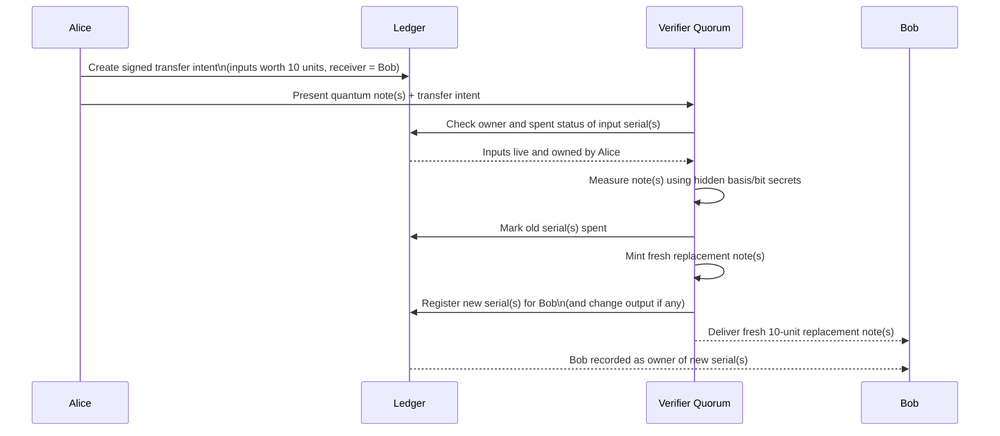

# Software MPS Quorum Design for QMoney

This document preserves the original technical appendix-style design for the current QMoney simulator track.

It describes the simplest software-only path to a larger-qubit **quorum-verified private-key quantum cash** system using:
- BB84 product states
- verifier-held secret basis/bit data
- verify-and-remint semantics
- very low entanglement, so the bill remains MPS-friendly

This is a **private-key** design note for the current baseline, not a public-key quantum money construction.

---

## 1. Design goal

The baseline simulator targets a path to **512 or 1024 qubits** that:
- keeps the quantum note easy to simulate in software
- supports **public access to verification requests** via a verifier quorum
- avoids exotic public-key quantum money constructions
- uses a BB84 product-state note family with MPS bond dimension `D=1`

The key architectural move is:
- keep the quantum note family simple and private-key
- put distributed coordination in the classical settlement/quorum layer

---

## 2. Verification by a quorum, not by the bill holder

The simplest scalable design for the current repo is to make verification an **online quorum service**.

### Core model
- A verifier quorum collectively holds the bill’s hidden verification data.
- The bill holder does **not** learn the full verification secret.
- Verification consumes the presented note by measurement.
- If valid, the quorum re-mints a fresh note for the receiver.

This preserves the core anti-counterfeiting story:
- the note is hard to clone because the secret measurement rule remains hidden
- the system can still circulate value through verify-and-remint

This is “public” only in the limited sense that **anyone can request verification from the network**. It is **not** non-interactive public-key quantum money.

---

## 3. Data model

For a bill with `n ∈ {512, 1024}` qubits:

- `serial`: unique identifier, e.g. 128-bit random
- `owner_pk`: current owner public key in the classical ledger
- `C`: optional public commitment to hidden verification data, e.g. `C = H(serial || B || V || nonce)`

Hidden verifier-held data:
- `B ∈ {0,1}^n`
  - `B[i]=0` means measure qubit `i` in the Z basis
  - `B[i]=1` means measure qubit `i` in the X basis
- `V ∈ {0,1}^n`
  - expected outcome in that basis

In the current simulator, these are represented concretely by `BillSecret.basis` and `BillSecret.bits`.

---

## 4. Quantum state preparation

Each qubit `i` is prepared as a BB84 state:

- if `B[i]=0` and `V[i]=0`: `|0⟩`
- if `B[i]=0` and `V[i]=1`: `|1⟩`
- if `B[i]=1` and `V[i]=0`: `|+⟩`
- if `B[i]=1` and `V[i]=1`: `|−⟩`

The full bill is a tensor product of these single-qubit states.

### Why this matters
Because the bill is a product state:
- it has **very low entanglement**
- it is naturally representable as an MPS with bond dimension `D=1`
- software simulation scales linearly in `n` as long as no entangling gates are introduced

That is why this note family is a good software baseline.

---

## 5. Verify-and-remint protocol

A system-level transfer looks like this:

1. **Transfer intent**
   - sender creates a classical transfer intent naming `(old_serial, receiver_pk, ...)`
   - sender signs it with the classical ownership key

2. **Present bill**
   - sender submits the quantum note plus transfer intent to the verifier quorum

3. **Quorum verification**
   - the quorum measures the note in the secret bases `B`
   - it checks the resulting outcomes against `V`
   - all qubits are checked across the participating quorum members

4. **Ledger update**
   - if accepted: mark `old_serial` spent and attach the new note to `receiver_pk`
   - if rejected after measurement: mark `old_serial` spent/invalid, since the state was consumed
   - if a quorum cannot be assembled **before verification starts**: abort and leave the original note live

5. **Re-mint**
   - the quorum generates a fresh `(new_serial, B', V')`
   - the quorum prepares a fresh `n`-qubit note for the recipient

This gives one-time quantum spend semantics with repeated circulation achieved by re-minting.

### 5.1 Concrete 10-unit transfer semantics

When two people transfer `10` units in the current QMoney architecture, the cleanest model is:

- Alice owns some spendable note inventory worth `10` units
- Alice creates a classical transfer intent naming Bob as the receiver
- Alice presents the relevant note or notes to the verifier quorum
- the quorum verifies and **consumes** the presented quantum state(s)
- if the transfer is accepted, the ledger marks the old serials spent
- the quorum mints fresh replacement note(s) for Bob with the same total value

There are two natural denomination models:

#### Model A — one 10-unit note
- Alice owns a single note with value `10`
- she spends that note once
- the old serial is marked spent
- Bob receives one fresh 10-unit note with a new serial

#### Model B — UTXO-style bundle of ten 1-unit notes
- Alice owns ten distinct 1-unit notes, each with its own serial
- the transfer intent lists the ten input serials
- the quorum verifies each presented note
- all accepted input serials become spent
- Bob receives either:
  - ten fresh 1-unit notes, or
  - one consolidated 10-unit replacement note

The current code in `pkey_quorum/demo.py` implements the **note-transfer primitive** (`mint_bill`, `verify_and_remint`, spent-state, owner tracking), but it does **not** yet implement explicit denomination arithmetic. So the most accurate reading today is:

> denomination and coin-selection semantics live at the classical ledger layer, while the current simulator demonstrates how each submitted quantum note is consumed and replaced by a fresh note for the receiver.

### 5.2 Bitcoin-style UTXO interpretation

A Bitcoin-like ledger layer can sit cleanly on top of the current quantum-note primitive.

For a 10-unit payment from Alice to Bob:

1. Alice selects a set of unspent QMoney note serials whose values sum to at least `10`.
2. She signs a transfer intent naming:
   - input serials
   - Bob's owner public key
   - optional change output back to herself
3. The quorum verifies each referenced input note.
4. Every verified input note is consumed by measurement and marked spent.
5. The quorum re-mints fresh output notes matching the transaction outputs.

Example:

- inputs: `6 + 4`
- outputs: `10 to Bob`

Or with change:

- inputs: `6 + 6`
- outputs: `10 to Bob`, `2 back to Alice`

In that sense, the quantum layer behaves like a consumptive authenticity check for each input UTXO, while the classical layer handles value accounting and output assignment.

### 5.3 Message-sequence view of a 10-unit transfer

This diagram captures the key difference from ordinary bearer cash: Bob does **not** receive the exact same quantum object Alice held. Bob receives a **freshly minted replacement note** after quorum verification consumes Alice's submitted note.

---

## 6. Mapping to the current implementation

The current code implementing this baseline is in [`pkey_quorum/demo.py`](../../pkey_quorum/demo.py).

### Main objects
- `Bill`
  - current note: serial + qubit list
- `BillSecret`
  - hidden basis/bit verification rule
- `Ledger`
  - spent-state and owner tracking
- `QuorumNode`
  - secret-holding verifier node
- `QuorumService`
  - minting and `verify_and_remint`

### Current implementation behavior
The implementation currently guarantees:
- a bill is only verified if quorum participation is available
- if quorum is unavailable before verification starts, the bill remains live
- if verification starts, the bill is consumed by measurement
- all qubits are measured across the quorum, not just a threshold prefix
- accepted bills are re-minted with a fresh serial for the receiver
- double-spend attempts fail at the ledger layer

The test coverage in `tests/test_pkey_quorum.py` currently checks:
- all qubits are measured even when threshold is less than node count
- a bill is not spent when quorum cannot be assembled before verification begins

---

## 7. MPS / simulation requirements

For this baseline note family, the simulator only needs:
- single-qubit state preparation
- Hadamard transforms for X-basis measurement
- projective measurement with collapse
- optional simple noise channels like per-qubit bit-flip

### Practical rule of thumb
- ordinary state-vector simulation is comfortable up to roughly `30–32` logical qubits
- beyond that, low-entanglement tensor-network / MPS methods become the natural route
- for this specific product-state note family, bond dimension stays `D=1` unless the design is changed to introduce entanglement

### Classical simulator requirement vs quantum hardware requirement
- **Classical requirement:** enough conventional compute and memory to simulate the logical qubit count of interest; dense state-vector methods top out around `30–32` logical qubits before MPS/tensor-network methods become preferable.
- **Quantum hardware requirement:** enough real, controllable logical qubits to prepare, preserve, and measure the target note family with acceptable noise and loss.

That is why the repo can legitimately target larger software-only qubit counts while keeping the current note family simple, while still being honest that real hardware deployment is a different requirement boundary.

---

## 8. Acceptance rule and noise tolerance

A baseline acceptance rule is:
- measure all `n` qubits
- accept if `matches ≥ n - t`

Where:
- `matches` = number of outcomes matching the hidden secret bits
- `t` = allowed mismatch budget from noise or implementation tolerance

### Current implementation parameters
The demo exposes:
- `--tolerance`
- `--noise-bitflip`
- `--seed`

This allows the simulator to explore:
- exact-match acceptance (`t=0`)
- simple noisy channels
- forged-note failure under imperfect measurement conditions

---

## 9. Security intuition for the baseline

In the simplest intercept/resend model, a counterfeiter without `B` must guess a basis for each qubit.

Per qubit, success is:
- correct basis: success probability `1`
- wrong basis: success probability `1/2`

Averaging over hidden bases gives:
- per-qubit success probability `3/4`

So for exact matching on all qubits:
- `P_forge = (3/4)^n`

Security bits are approximately:
- `s = -log2(P_forge) = n * log2(4/3) ≈ 0.415 * n`

Examples:
- `n=512` → about `212.5` bits
- `n=1024` → about `425` bits

This is only the simple product-state intercept/resend threat model, but it is the right baseline story for the current simulator track.

---

## 10. Suggested software-only parameters

Good starting points for the baseline simulator:

- qubits per bill: `n=512` or `n=1024`
- current code path: `threshold` is the minimum number of live verifier nodes required to start verification; once that gate passes, the demo measures across all participating nodes with replicated secrets
- future direction: explore explicit `2f+1` approval semantics out of `3f+1` nodes rather than the current availability-gate simplification
- tolerance: start with `0`, then introduce small mismatch budgets under noise
- secret storage:
  - start with full replication across quorum nodes in software
  - later explore threshold sharing or partial secret distribution

The current demo is intentionally conservative and simple. Its job is to make the architecture clear and executable, not to claim a production-ready quantum money system.

---

## 11. Why keep this design note separate from the README

The README should stay short and repo-facing.

This document exists to preserve the more technical appendix-style material:
- larger-qubit simulator target
- concrete note data model
- exact protocol flow
- acceptance/tolerance mechanics
- forge-rate intuition
- implementation mapping

That makes this the right place for the original appendix content to live going forward.

---

## 12. Status

This document matches the **current private-key baseline**.

It should evolve only when the implementation meaningfully changes, for example if QMoney adds:
- entangled note families
- more realistic noise models
- threshold-shared secrets in code
- richer quorum fault handling
- a separate public-key note-family namespace
